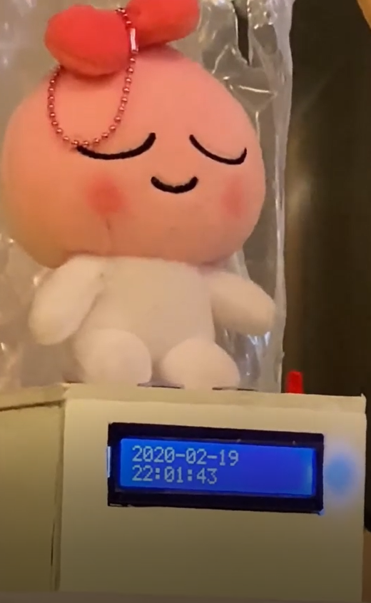

# HAVE-IT
## (Habbit 개선 프로젝트)

#### Responsive Single Page Application
#### 반응형 웹 기반 알람이

## Introduction
" HAVE - IT "는 사용자의 습관개선을 도와주는 반응형 알람 서비스입니다. 날짜별로 직접 알림을 설정하여 인형(디바이스)에게 알려주고, 실천 여부를 분석하여 달성률과 분석 현황을 한눈에 제공해드립니다.

방석 서비스를 추가 구매하신다면, 여러분의 자세를 7가지(정자세, 기울임, 다리 꼰 자세)로 분류해 분석하고 정자세를 유지할 수 있도록 도와드립니다.

여러분의 꿈을 이루기 위한 " 실천 "을 도와드리겠습니다!
##### Do-it. Have-it.

## steps
> *평가 관련 공지 안내해드립니다.*
> **저희 프로젝트는 "웹과 디바이스의 연결"을 필수적인 전제조건으로 하여, 인형등록이 완료되어야 습관설정과 데이터를 관리할 수 있습니다.**
> **하지만 ~~코로나19 휴강~~으로 인해, 현재는 습관설정이 불가능합니다.**
> **아래의 계정으로 로그인 하신 후, [4. 습관통계] 부터 진행하시면서 [3. 습관 설정]을 제외한 데이터 분석 및 현황을 확인해보세요.**
>
> ```
> ID: DLee
> PW: haveit
> ```
> 
> **웹과 디바이스의 전체 동작을 확인하시고 싶으시다면, 다음의 UCC를 통해 확인이 가능합니다.**
> https://youtu.be/O1Jw5uLvYBY
- - -

### 1. 인형(디바이스) 구매
여러분이 설정한 알림을 안내해 줄 귀여운 인형을 선택하세요. 당신만의 귀여운 1:1 개인 비서를 만나보세요!

<p align="center">
  
</p>

- - -

### 2. 회원가입
> **~~코로나19 휴강~~관련, 회원가입의 계정 등록은 테스트 가능하지만 직접 가입하신 계정으로는 다른 기능이 작동하지 않습니다.**
> **상단 공지에 따라 "DLee"로 로그인하신 후, [4. 습관통계]부터 이어가시면 됩니다.**

 1. " Have-it " 홈페이지에 접속합니다.

 <http://haveit.coo.kr>

 2. 하단의 "Go to Sign up"을 클릭하여 5개 항목을 기입하시고 "회원가입" 버튼을 눌러주세요.

 3. 우측 상단에 위치한 기입하셨던 닉네임에서 "회원정보"를 클릭해주세요.

 4. "인형등록" 버튼을 눌러, 구매하신 인형에 적힌 시리얼번호와 여러분만의 인형 이름을 지어주세요!
- - -

### 3. 습관 설정
> **~~코로나19 휴강~~관련, 디바이스가 OFF 상태이므로 본 페이지의 모든 동작이 작동하지 않습니다.**
> **상단 공지에 따라 "DLee"로 로그인하신 후, [4. 습관통계]부터 이어가시면 됩니다.**

 1. "습관 추가하기" 버튼을 눌러, 여러분이 등록할 습관과 알맞는 아이콘을 선택해주세요.

 2. 등록된 습관 우측에서 요일(S, M, T, W, T, F, S, All)을 클릭하고, "추가" 버튼을 눌러주세요.

 3. 여러분이 등록한 기기의 이름을 선택하신 후, 해당 습관 알람이 동작할 요일과 시간을 설정해주세요.

 4. 잠시 중지하고 싶으시면 '||'을, 삭제를 하고 싶으시면 'x'를 눌러주시면 됩니다.
- - -

### 4. 습관 통계
> **~~코로나19 휴강~~관련, 디바이스가 OFF 상태이므로 직접 가입하신 계정으로는 데이터가 없어 통계가 나타나지 않습니다.**
> **상단 공지에 따라 "DLee"로 로그인하시면, 등록되어 있는 데이터에 따라 페이지를 확인하실 수 있습니다.**
> **또한 디바이스를 통한 데이터 센싱이 불가능하여, "2/26 ~ 3/3"의 데이터만 확인이 가능합니다.**

 1. 여러분의 설정했던 습관들의 아이콘을 클릭하시어, 습관별 달성률을 확인하실 수 있습니다. "All"은 모든 습관들의 총 달성률을 보여줍니다.

 2. 제일 상단 그래프는 월별 달성률을 보여줍니다. 지나간 월별 달성률을 확인해보세요!

 3. "달력"에서 날짜를 클릭하시면, 해당 요일의 총 습관 달성률을 확인하실 수 있습니다.
 > **~~코로나19 휴강~~관련,"2/26 ~ 3/3"의 데이터에서만 확인이 가능합니다.**

 4. 그 다음은 여러분이 위 달력에서 선택한 요일에 따라, 실천했던 습관들의 세부 시간을 확인하실 수 있습니다.
- - -

### 5. 보조 기구
> 추가로 "Have-it 방석 서비스"를 구매하셨다면, "Cushion"에서 여러분의 자세 데이터를 분석하여 알려드립니다.
 1. Today별로 방석 데이터에서 센싱한 여러분의 "정 자세"비율을 보여드립니다.**100%**에 가까운 비율이 되도록 바른 자세를 유지하세요!

 2. 방석 서비스에서 분석한 여러분의 자세를 7가지 타입으로 분석하여, Today별 누적 데이터를 확인하실 수 있습니다.

 3. 모든 자세들의 데이터는 월별로 확인이 가능합니다. 