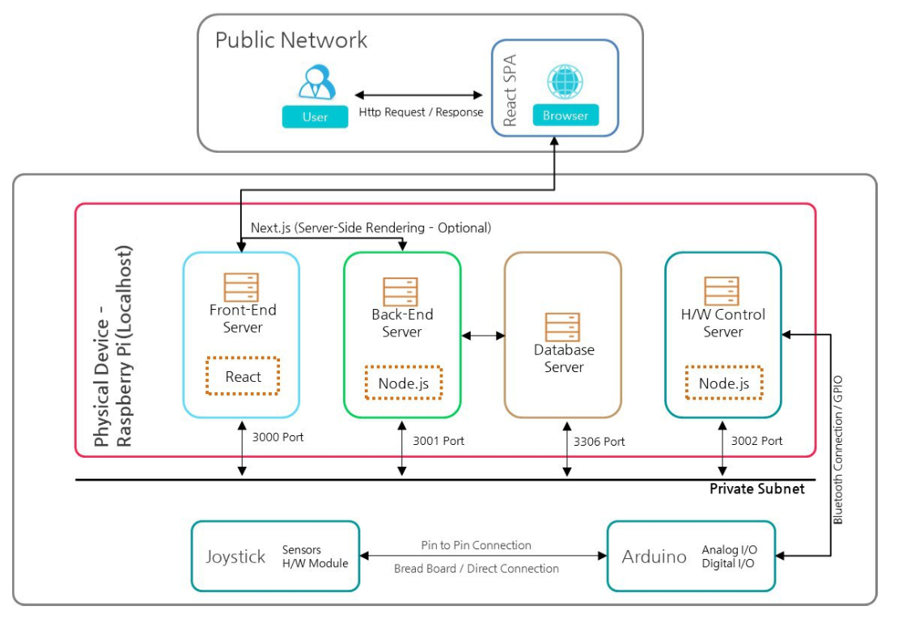
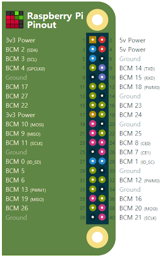
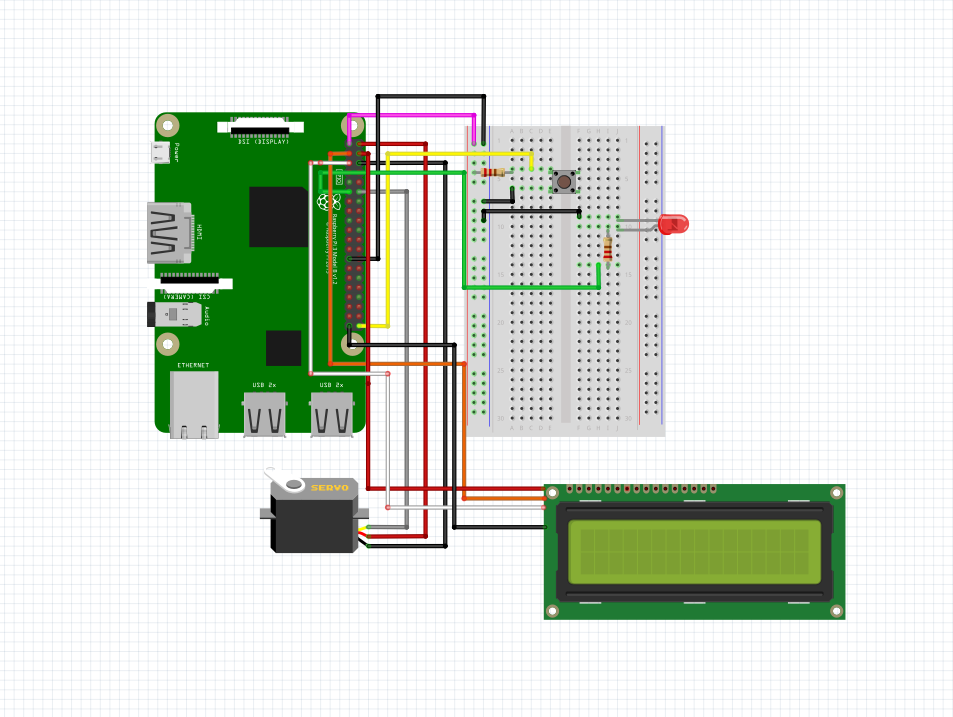

# HAVE-IT
## (Habbit 개선 프로젝트)

#### Responsive Single Page Application
#### 반응형 웹 기반 알람이

## Introduction
" HAVE - IT " 는 React로 구성된 UI를 chromium 웹 브라우저에서 구동하여, Raspberry-pi 4에 연결된 I2C 통신 방식의 소형 LCD 모니터에 출력해줍니다. React UI는 사용자의 회원가입을 거쳐 로그인을 실행하고, 사용자마다 설정한 알람 기능을 설정합니다. 메인 UI에는 사용자가 설정한 알람에 대해, AWS내 MySql DB에서 일간 수행 내역을 계산하여 Circular-Graph로 한번에 보여줍니다. Back-End는 Node.js 기반의 웹 프레임워크인 Express에 기반하여 DB와 Front-End인 React, Hardware인 Raspberry-pi 4 서버와 연동하는 API Server의 역할을 담당합니다.

이를 통해 사용자마다의 설정된 알람이, WiFi통신으로 연결된 Raspberry-pi 4 컨트롤을 통해 IoT를 통한 사용자 UI를 제공해줍니다. 또한 사용자의 직접적인 Switch 동작으로 알람의 실행 데이터를 발생시켜, API Server를 통해 React UI인 웹에서 확인할 수 있는 환경을 제공합니다.

- 현재 시간에 맞춰 동기화된 알람 내역을 수행
- Switch Interface를 통해 사용자의 실제 알람 수행 여부 데이터 관리
- 일간, 월간 총 습관 개선 수행 정보를 Percentage Circular Graph로 User UI/UX 제공


## System Architecture

<p align="center">
  
</p>

" HAVE-IT " 에서는 Raspberry-pi 4가 H/W Control Service의 역할을 담당합니다. 내부에서는 실제로 사용되는 디바이스 모듈을 제어할 수 있도록, Raspberry-pi 전용 Express 기반 API Server를 구동합니다. 또한 디바이스 마다 사용자의 알람 Data를 저장할 수 있도록 내부 MySql과 연동되어, 실제 Main Back-End 서버와 디바이스 모듈 사이에서 제어와 데이터 연동을 담당합니다. 이를 위해 WiFi를 이용해 내부 고정 IP를 할당하고, 전원이 인가되는 상황에서 항시 데이터 발생의 송수신을 제어합니다.


## steps
실행 가능한 기능은 다음과 같습니다. *2019 / 01 / 31 기준*
- Web에서 회원과 로그인이 이루어지면, Back-end인 API Server를 통해 DB에 업데이트
- 해당 정보가(ex.닉네임) Hardware인 Raspberry-pi까지 출력

### 1. Update the Raspberry Pi
첫 째, Raspberry-Pi의 업데이트가 필요합니다. 터미널 환경에서 다음과 같은 명령을 입력합니다:
```
sudo apt-get update
sudo apt-get upgrade
```

둘 째, 외부 AWS API 서버와의 연결을 위해, ngrok환경을 설치해 줍니다.

https://ngrok.com/download

셋 째, ngrok을 실행시켜 줍니다.
```
./ngrok http 3000
```
이를 실행하면 3000번 port를 통해 외부 접속 가능한 사이트를 자동 생성해 줍니다.

넷 째, Raspberry-Pi 4와 디바이스 모듈의 회로를 구성합니다.

<p align="center">
  
</p>

<p align="center">
  
</p>


### 2. React(Web)
첫 째, " Have-it " 홈페이지에 접속합니다.

http://localhost:3000

둘 째, 사용자 정보를 입력합니다.


### Usage
실행을 위한 기본 설정은 완료되었습니다. 이제 Web에서 입력한 닉네임이 Raspberry-Pi가 제어하는 LCD에 출력되는지 확인해보세요!